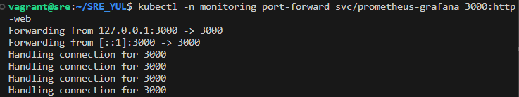
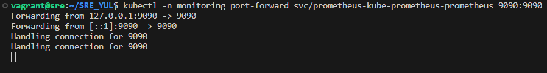
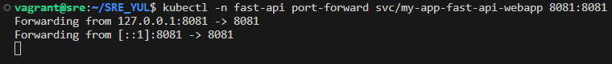
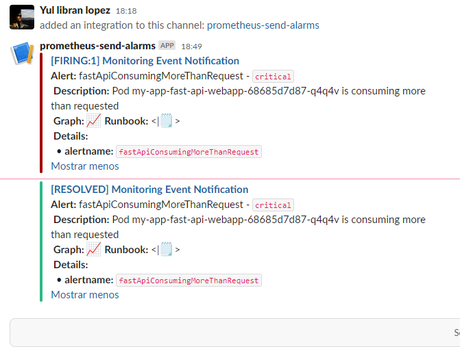

# SRE_YUL

## Descripción

Se trata de una app creada en **Python** con [**FastAPI framework**](https://fastapi.tiangolo.com/es). Dispone de endpoints con monitorización mediante el stack de **Prometheus**. La visualización de las metricas se realizara con **Grafana**. Ademas se reciven alarmas mediante **Slack**

## Software

- [Python](https://www.python.org/downloads/)
- [Docker](https://docs.docker.com/engine/install/)
- [Docker-compose](https://docs.docker.com/compose/install/)
- [Minikube](https://minikube.sigs.k8s.io/docs/start/)
- [Kubectl](https://kubernetes.io/docs/tasks/tools/)
- [Helm](https://helm.sh/docs/intro/install/)

## Estrucutra del directorio

- **.github/workflows/**
  - **release.yaml** Workflow para la construcción y subida a un repositorio publico de la imagen de la app.
  - **test.yaml** Workflow de test para la app.
  
- **fast-api-webapp/../** Contiene los manifiestos de Kubernetes para en el clúster
- **kube-prometheus-stack/./** Contiene el manifiesto de Kubernetes la configuración de **Prometheus**-slack

- **src**: Contiene archivos de **.py** de la aplicación.
  - **aplication/app.py** Código de la app **Python**
  - **app.py**: Código para ejecutar de la app
- **test**: Contiene el archivo para realizar los test en el Pipeline
  - **app_test.py**
- **Dockerfile**: Instrucciones para crear la imagen Docker.
- **requirements.txt**: Contiene los requerimientos para la app
- **Makefile** Archivo donde se construye la forma de generer la el nombre y la imagen para subir a **DockerHub**
- **package.json** Archivo de configuración para semantic-release de **GitHub**

## Ejecución de código

### Prerequisitos

1. Disponer de una VM con **Ubuntu 22.04**

2. Crear un cluster de Kubernetes que utilice la versión `v1.21.1` utilizando minikube para ello a través de un nuevo perfil llamado `monitoring-demo`:

    ```sh
    minikube start --kubernetes-version='v1.28.3' \
        --cpus=4 \
        --memory=4096 \
        --addons="metrics-server,default-storageclass,storage-provisioner" \
        -p monitoring-demo
    ```
   1.  Comprobar que el cluster este creado mirando el listado:

        ```sh
        minikube profile list
        ```
   2. Añadir el repositorio de helm `prometheus-community` para poder desplegar el chart `kube-prometheus-stack`:

    ```sh
    helm repo add prometheus-community https://prometheus-community.github.io/helm-charts
    helm repo update
    ```

   3. Desplegar el chart `kube-prometheus-stack` del repositorio de helm añadido en el paso anterior con los valores configurados en el archivo `kube-prometheus-stack/values.yaml` en el namespace `monitoring`:

    ```sh
    helm -n monitoring upgrade \
        --install prometheus \
        prometheus-community/kube-prometheus-stack \
        -f kube-prometheus-stack/values.yaml \
        --create-namespace \
        --wait --version 55.4.0
    ```

   4. Realizar split de la terminal o crear una nueva pestaña y ver como se están creando pod en el namespace `monitoring` utilizado para desplegar el stack de **prometheus**:

    ```sh
    kubectl -n monitoring get pod -w
    ```

## Ejecución

### Despliegue de aplicación

1. Desplegar el helm chart:

        ```sh
        helm -n fast-api upgrade my-app --wait --install --create-namespace fast-api-webapp
        ```
2. Abrir otra terminal para visualidad la inicialización del chart

        ```sh
        kubectl -n fast-api get pod -w
        ```
2. Abrir una nueva pestaña en la terminal para realizar un port-forward del puerto `http-web` del servicio de Grafana al puerto 3000 de la máquina:

    ```sh
    kubectl -n monitoring port-forward svc/prometheus-grafana 3000:http-web
    ```
    > 

3. Abrir otra pestaña en la terminal para realizar un port-forward del servicio de **Prometheus** al puerto 9090 de la máquina:

    ```sh
    kubectl -n monitoring port-forward svc/prometheus-kube-prometheus-prometheus 9090:9090
    ```
    > 

4. Abrir una nueva pestaña en la terminal para realizar un port-forward al `Service` creado para nuestro servidor:

    ```sh
    kubectl -n fast-api port-forward svc/my-app-fast-api-webapp 8081:8081
    ```
    > 

5. Abrir una nueva pestaña en la terminal para realizar un port-forward la `Metrica` del servidor:

    ```sh
    kubectl -n fast-api port-forward svc/my-app-fast-api-webapp 8000:8000
    ```

6. Acceder a `localhost:3000` en el navegador para acceder a Grafana. El Login por defecto User: `admin` y Password: `prom-operator`.

7. Acceder a `localhost:9090` para acceder al **Prometheus**, **por defecto no se necesita autenticación**.

### Test endpoint

1. Para realizar peticiones al servidor de fastapi se puede hacer de 2 maneras:
   
   1. A través de la URL `localhost:8081/docs` utilizando swagger
   
   2. O realizando: 

        ```sh
      curl -X 'GET' \
      'http://0.0.0.0:8081/' \
      -H 'accept: application/json'
      ```

      Debería devolver la siguiente respuesta:

      ```json
      {"msg":"Hello World"}
      ```

   - Realizar una petición al endpoint `/bye`

      ```sh
      curl -X 'GET' \
        'http://localhost:8081/bye' \
        -H 'accept: application/json'
      ```

      Debería devolver la siguiente respuesta.

      ```json
      {"msg":"Bye Bye"}
      ```

    - Realizar una petición al endpoint `/health`

        ```sh
        curl -X 'GET' \
          'http://localhost:8081/health' \
          -H 'accept: application/json'
        ```

        Debería devolver la siguiente respuesta.

        ```json
        {"health": "ok"}


2.  Acceder al dashboard creado para observar las peticiones al servidor a través de la URL `localhost:3000/dashboards`, seleccionando una vez en ella la opción Import y en el siguiente paso seleccionar **Upload dashboard JSON file** y seleccionar el archivo presente en esta carpeta llamado `GrafanaDashboard_Yul.json`.

### Test de estrés

1.  Ejecute el siguiente comando para obtener el pod creado así como seleccionarlo en el menú desplegable del panel de grafana:

        ```sh
        export POD_NAME=$(kubectl get pods --namespace fast-api -l "app.kubernetes.io/name=fast-api-webapp,app.kubernetes.io/instance=my-app" -o jsonpath="{.items[0].          metadata.name}")
        echo $POD_NAME
        ```

        Se debería obtener un resultado similar al siguiente:

        ```sh
        my-app-fast-api-webapp-68685d7d87-947x5
        ```

2. Acceder mediante una shell interactiva al contenedor `fast-api-webapp` del pod obtenido en el paso anterior:

    ```sh
    kubectl -n fast-api exec --stdin --tty $POD_NAME -c fast-api-webapp -- /bin/sh
    ```

    1. Instalar los binarios necesarios en el pod

        ```sh
        apk update && apk add git go
        ```

    2. Descargar el repositorio de github y acceder a la carpeta de este, donde se realizará la compilación del proyecot:

        ```sh
        git clone https://github.com/jaeg/NodeWrecker.git
        cd NodeWrecker
        go build -o extress main.go
        ```

    3. Ejecución del binario obtenido de la compilación del paso anterior que realizará una prueba de extress dentro del pod:

        ```sh
        ./extress -abuse-memory -escalate -max-duration 10000000
        ```

    4. Abrir dos nuevas terminales para ver la evolución del HPA creado para la aplicación web y se crean nuevos pods para la aplicación:

        ```sh
        kubectl -n fast-api get hpa -w
        ```

        ```sh
        kubectl -n fast-api get pod -w
        ```

    5.  Se debería recibir una notificación como la siguiente en el canal de Slack configurado para el envío de notificaciones sobre alarmas:

        > 

### Parar el cluster

1. Para detener el cluster:

    ```sh
    minikube start -p monitoring-demo    
    ```

### Slack-Prometheus

1. Se ha creado un espacio de trabajo utilizando: [Slack](https://slack.com/get-started#/createnew): https://yul-sre.slack.com y posteriosmente una aplicación con: [SlackAPI](https://api.slack.com/apps?new_app=1) asociandolo al **Workspace** creado antes. Se ha congigurado los **Incoming Webhooks** añadiendolo al **Workspace**


## Fuentes

- **Kubernetes**: https://kubernetes.io/es/
- **Helm**: https://helm.sh/
- **Docker**: https://www.docker.com/
- **DockerHub**: https://hub.docker.com/
- **Python**: https://www.python.org/
- **ChatGPT**: https://chat.openai.com/
- **Grafana**: https://grafana.com/docs/?plcmt=footer
